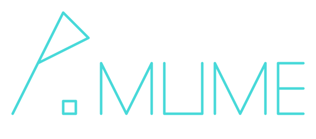

# p.mume

    

An open source status page system fork from [Cachet](https://cachet.io) `v2.4.0-dev`.

We thought that the Cachet development is too slow and heavy.

So we fork the project to try make it simple and easy.

## License

Licensed under [BSD 3-Clause "New" or "Revised" License](LICENSE).

> (c) 2020 [Star Inc](https://starinc.xyz).
